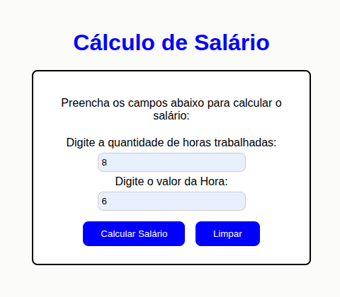
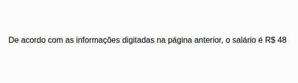

# Atividade de PW2 — Cálculo de Salário

Projeto desenvolvido para a disciplina de **Programação Web 2 (PW2)**, ministrada pelo **professor Marcelo**. Este trabalho apresenta uma página web simples para calcular o salário com base na quantidade de horas trabalhadas e no valor da hora, usando HTML, CSS e PHP.


## Descrição

A atividade consiste em criar um formulário que recebe:

- Quantidade de horas trabalhadas
- Valor pago por hora

Depois do envio, o sistema calcula o salário e mostra o resultado em outra página.


## Tecnologias utilizadas

- HTML5
- CSS3
- PHP

## Estrutura do projeto

```bash
/projeto
│── index.html
│── style.css
│── calcularSalario.php
└── imagens/
    ├── tela-inicial.png
    └── resultado-calculo.png
```

## Funcionamento

1. O usuário abre a página inicial.
2. Preenche os campos de horas trabalhadas e valor da hora.
3. Clica no botão para calcular.
4. O PHP recebe os dados do formulário.
5. O sistema multiplica os valores e exibe o salário final.

## Trecho principal do cálculo em PHP

```php
<?php
    $valor = $_POST['valor'];
    $horas = $_POST['horas'];
    $salario = $valor * $horas;
    echo "<p class='salario'>De acordo com as informações digitadas na página anterior, o salário é R$ " . $salario . "</p>";
?>
```

## Objetivo da atividade

Esta atividade tem como objetivo praticar:

- Criação de formulários HTML
- Estilização com CSS
- Envio de dados com o método POST
- Processamento de dados com PHP
- Exibição de resultados em páginas dinâmicas


## Fotos:







## Observações

- O arquivo `style.css` define o visual da página.
- O arquivo `index.php` contém o formulário.
- O arquivo `calcularSalario.php` processa o cálculo.

## Autor
Guilherme Izidio Nogueira

Atividade acadêmica desenvolvida para a matéria de **PW2**.