# Exercícios PHP — Programação Web II
> Estou aprendendo Docker, então resolvi usar para rodar o projeto localmente com PHP + Apache.

Exercícios desenvolvidos para a disciplina de **Programação Web II** do professor **Marcelo Colado**.

Projeto rodando com **PHP 8.2 + Apache** via Docker.

---

## Como rodar

```bash
docker compose up --build
```

Acesse em: [http://localhost:8080](http://localhost:8080)

---

## Exercícios

### Ex. 1 — Tabuada
A partir de um valor digitado, exibe a tabuada respectiva.

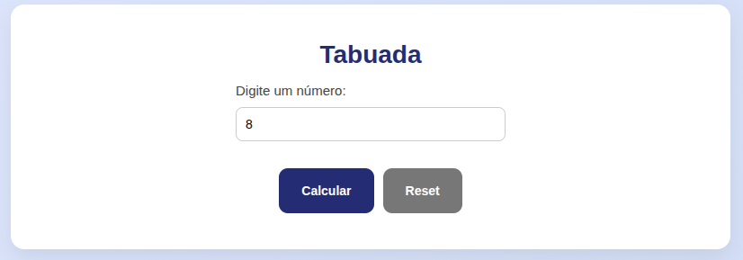
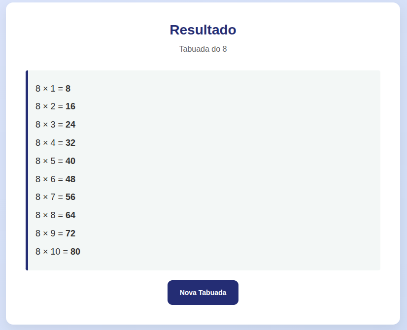

---

### Ex. 2 — Desconto
Calcula o valor com desconto de acordo com o preço e a porcentagem informada.

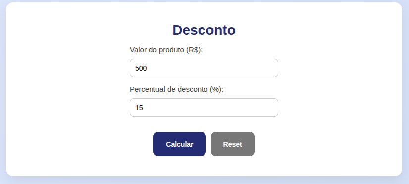


---

### Ex. 3 — Aprovação
Informa se o aluno foi aprovado ou reprovado com base na média das 4 notas bimestrais.
Aprovação a partir da média 5. Notas de 1 a 10.

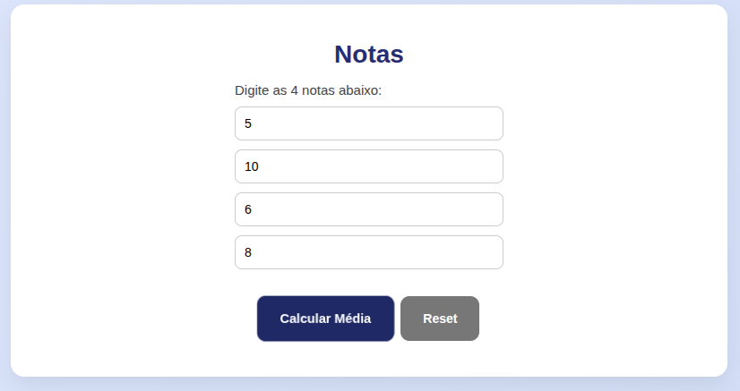
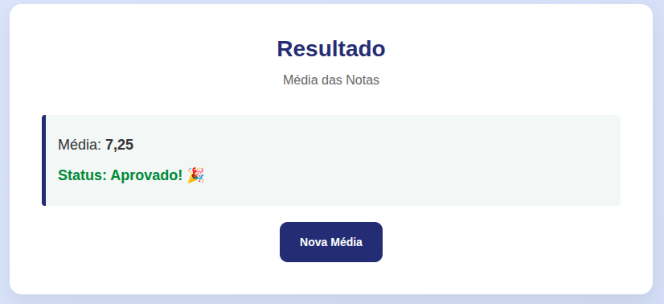

---

### Ex. 4 — Troca de Variáveis
Lê 2 valores inteiros nas variáveis A e B, efetua a troca dos conteúdos e os exibe.

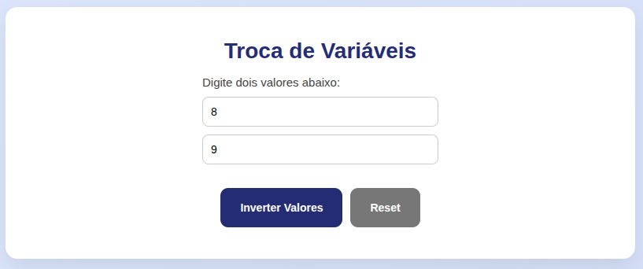
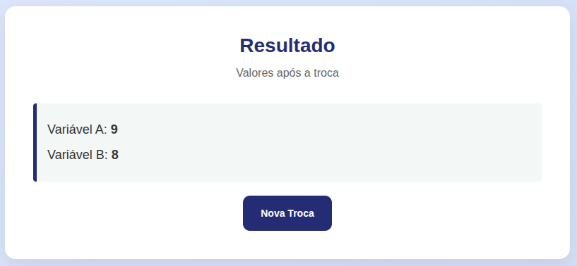

---

### Ex. 5 — Soma dos Quadrados
Lê 3 números e apresenta a soma dos quadrados dos 3 valores.

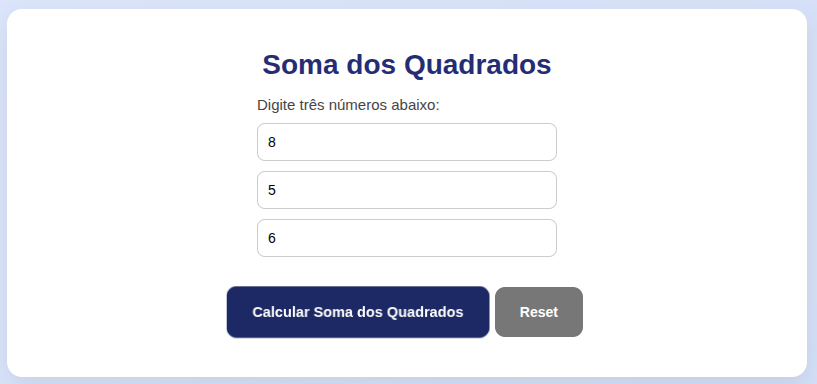
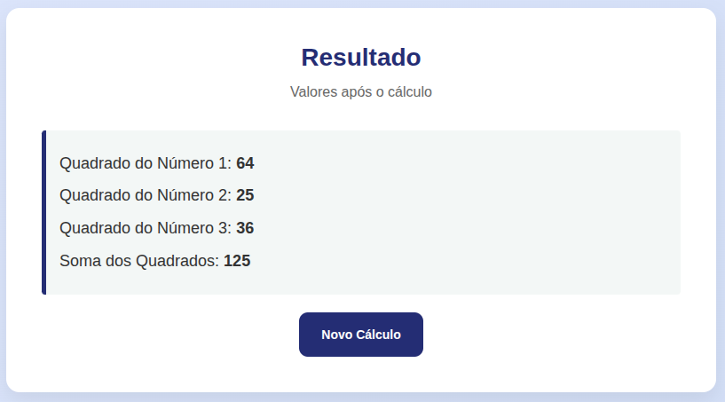

---

### Ex. 6 — Salário
Recebe o salário bruto e calcula o salário líquido com 10% de gratificação e 20% de imposto de renda.

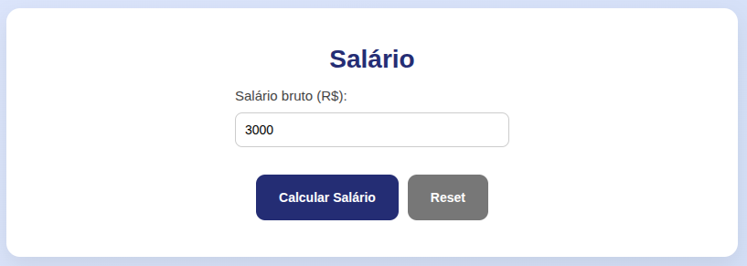
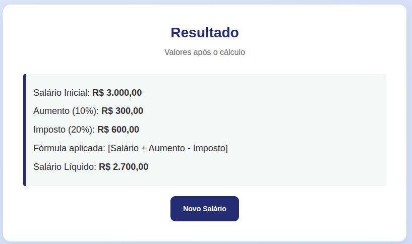

---

### Ex. 7 — Média
Lê 4 notas, calcula a média aritmética e exibe a situação:
- Média >= 6 → Aprovado
- Média >= 3 e < 6 → Exame
- Média < 3 → Retido

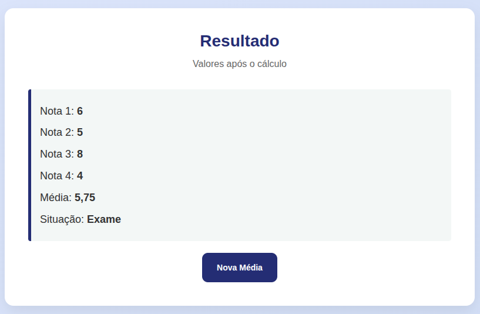

---

### Ex. 8 — Maior e Menor
Lê 3 números e exibe o maior e o menor valor digitado.

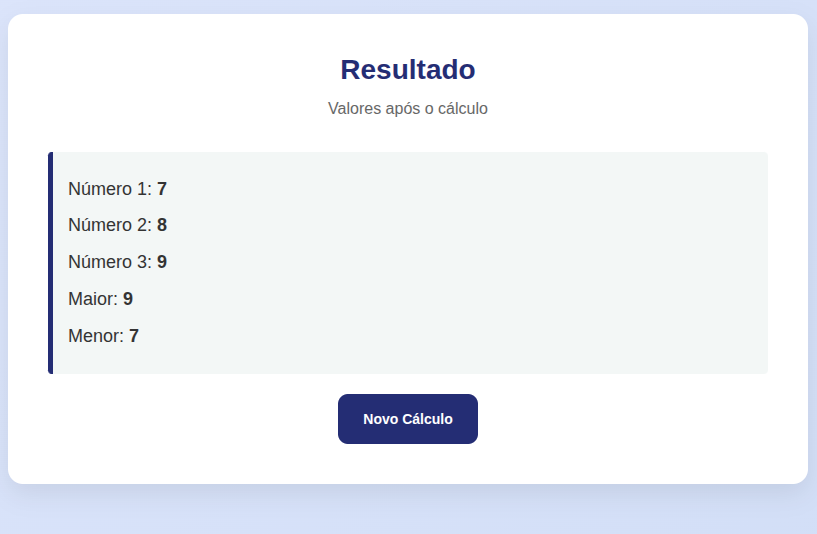

---

### Ex. 9 — Soma dos Ímpares
A partir de um valor inicial e um valor final, apresenta a soma dos números ímpares do intervalo.

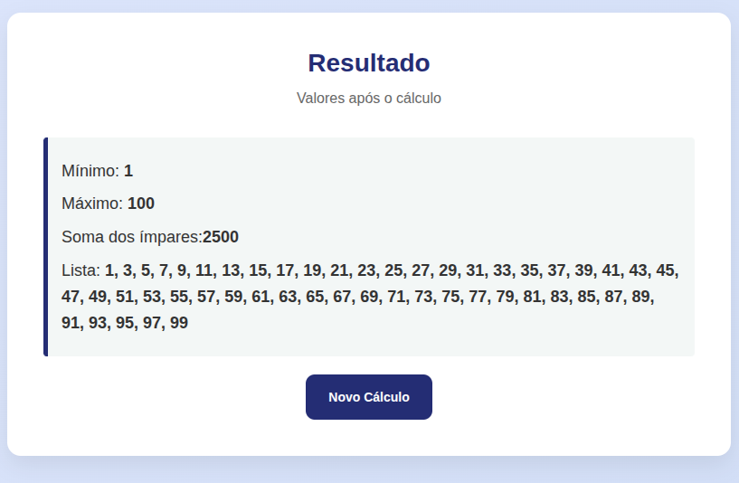

---

### Ex. 10 — Par ou Ímpar
Informa se o número digitado é par ou ímpar.

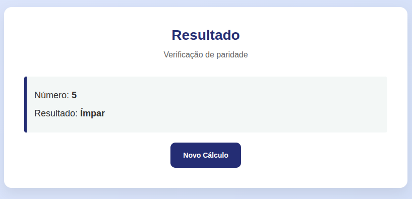

---

### Ex. 11 — Calculadora
Simula uma calculadora com as quatro operações básicas: soma, subtração, multiplicação e divisão.

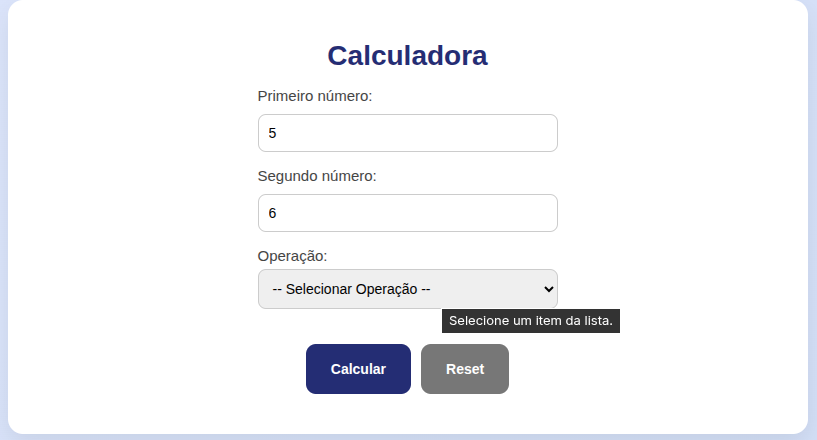
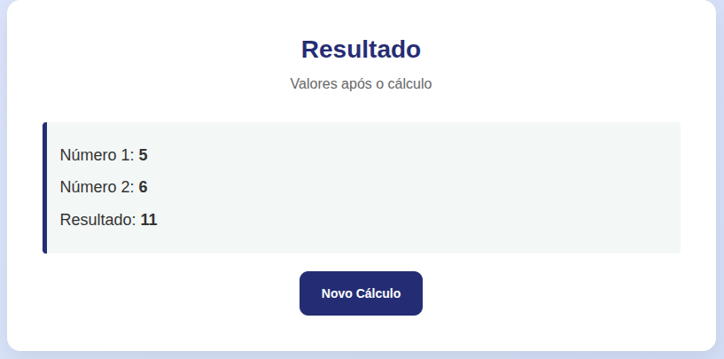

---

### Ex. 12 — Ordem Decrescente
Exibe em ordem decrescente apenas os números ímpares existentes entre dois valores digitados.

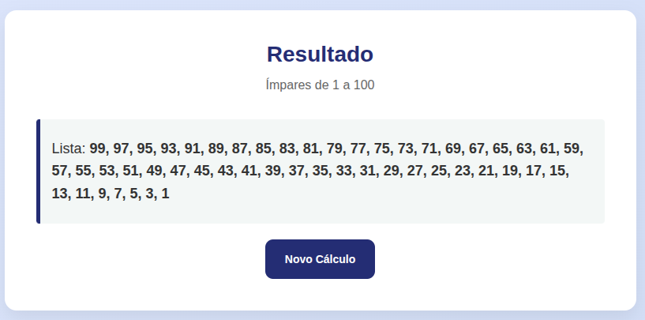

---

## Estrutura do projeto

```
app/
├── includes/
│   ├── nav.php
│   ├── footer.php
│   └── style.css
├── index.php
├── Tabuada.php
├── Desconto.php
├── Aprovacao.php
├── TrocaVariaveis.php
├── FinalDosQuadrados.php
├── Salario.php
├── Media.php
├── MaiorMenor.php
├── SomaImpares.php
├── ParImpar.php
├── Calculadora.php
└── Ordem.php
Images/
docker-compose.yml
Dockerfile
```

---

Desenvolvido por Guilherme Izidio © 2026
