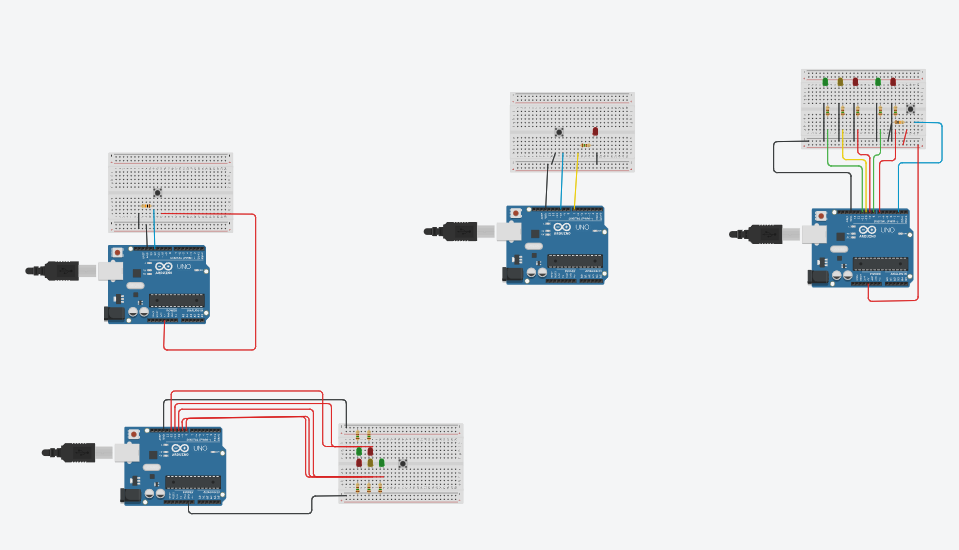

# 🔧 Visualização do Projeto no Tinkercad

Projeto desenvolvido no dia **23/02/2026**, durante a aula de **Sistemas Embarcados**, ministrada pelo *incrível professor* **Carlos Alberto** 🚀.

Este projeto foi criado e simulado na plataforma **Tinkercad**, com o objetivo de aplicar, na prática, os conceitos estudados em sala de aula.

---

## 🧩 Pré-visualização do Projeto

---

## 🔗 Link do Projeto

👉 Acesse o projeto diretamente no Tinkercad:
[🔗 Clique aqui para abrir o projeto](https://www.tinkercad.com/things/0SlnVJV0Dvw-coisas?sharecode=7Zlua4DCk_TV5367eWjQ-m6OgJSUc0DQQQT6BNerlXM)

---

## ⚠️ Status do Projeto

🚧 Este projeto **ainda está em desenvolvimento** e algumas funcionalidades ainda serão implementadas ou aprimoradas.
