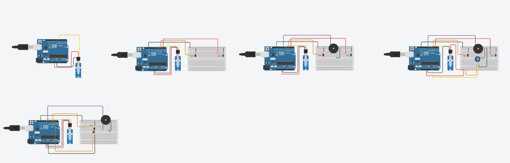
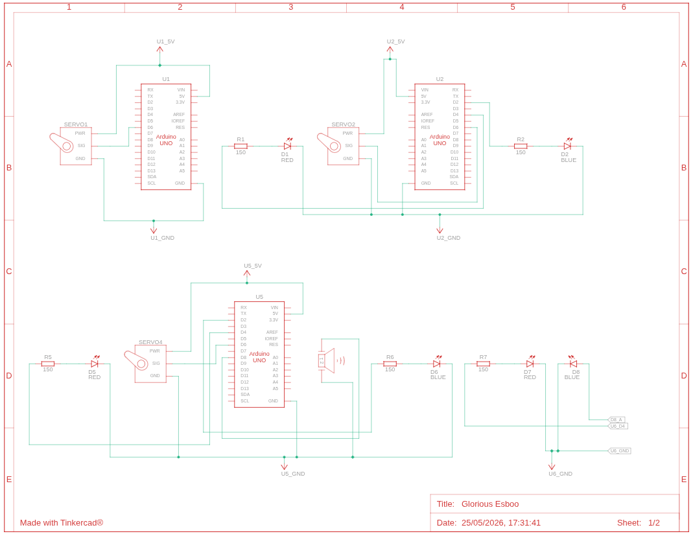
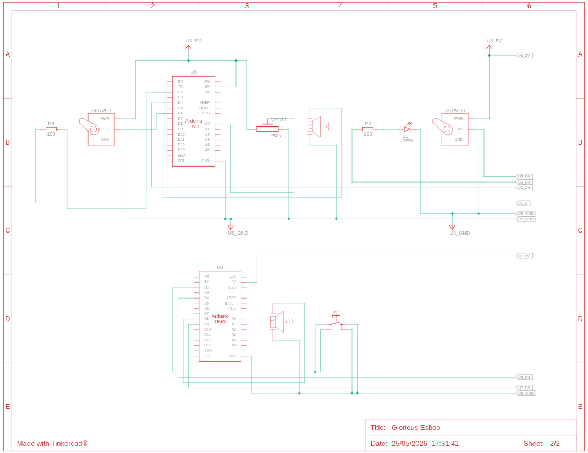

# 🤖 Controle de Servo Motor com Arduino

Projeto desenvolvido para a disciplina de **Sistemas Embarcados** — Prof. Carlos Alberto

---

## 📋 Descrição

Série de experimentos progressivos com **servo motor**, explorando diferentes formas de controle e periféricos adicionais (LED, buzzer, potenciômetro e botão). Cada etapa adiciona complexidade ao circuito, demonstrando na prática os conceitos de saída PWM, leitura analógica e entrada digital com debounce.

---

## 🛠️ Componentes Utilizados

| Componente         | Quantidade |
|--------------------|------------|
| Arduino Uno        | 1          |
| Servo Motor        | 1          |
| LED vermelho       | 1          |
| LED azul           | 1          |
| Resistor 150Ω      | 2          |
| Buzzer             | 1          |
| Potenciômetro 250k | 1          |
| Botão (push button)| 1          |
| Protoboard         | 1          |
| Jumpers            | Vários     |

---

## 📂 Etapas do Projeto

O projeto é dividido em **4 etapas evolutivas**, cada uma com seu próprio arquivo `.ino`:

### Etapa 1 — `Servo.ino` · Movimento básico

Servo oscila automaticamente entre **0° e 180°** em loop, sem periféricos extras.

**Pinagem:**

| Pino Arduino | Componente    |
|--------------|---------------|
| D6           | Servo (sinal) |

**Comportamento:**
- Vai de 0° a 180° (15 ms por grau)
- Aguarda 1 segundo
- Retorna de 180° a 0°
- Repete indefinidamente

```cpp
#include <Servo.h>
Servo servo;
int pos;

void setup(){
  servo.attach(6);
  servo.write(0);
  delay(1000);
}

void loop(){
  for(pos = 0; pos < 180; pos++){
    servo.write(pos);
    delay(15);
  }
  delay(1000);
  for(pos = 180; pos >= 0; pos--){
    servo.write(pos);
    delay(15);
  }
}
```

---

### Etapa 2 — `Servo-Led.ino` · Servo + LEDs indicadores

Adiciona **dois LEDs** que indicam a direção do movimento do servo.

**Pinagem:**

| Pino Arduino | Componente      |
|--------------|-----------------|
| D6           | Servo (sinal)   |
| D4           | LED vermelho    |
| D2           | LED azul        |

**Comportamento:**
- Abrindo (0°→180°): LED vermelho aceso, LED azul apagado
- Fechando (180°→0°): LED azul aceso, LED vermelho apagado

```cpp
#include <Servo.h>
Servo servo;
int pos;

void setup(){
  servo.attach(6);
  servo.write(0);
  pinMode(4, OUTPUT);
  pinMode(2, OUTPUT);
  delay(1000);
}

void loop(){
  for(pos = 0; pos < 180; pos++){
    servo.write(pos); delay(15);
    digitalWrite(4, HIGH); digitalWrite(2, LOW);
  }
  delay(1000);
  for(pos = 180; pos >= 0; pos--){
    servo.write(pos); delay(15);
    digitalWrite(4, LOW); digitalWrite(2, HIGH);
  }
}
```

---

### Etapa 3 — `Servo-Led-Buzzer.ino` · Servo + LEDs + Buzzer

Adiciona **buzzer** que emite sons diferentes ao completar cada movimento.

**Pinagem:**

| Pino Arduino | Componente      |
|--------------|-----------------|
| D6           | Servo (sinal)   |
| D4           | LED vermelho    |
| D2           | LED azul        |
| D8           | Buzzer          |

**Comportamento:**
- Ao completar abertura (180°): `tone(8, 250, 150)` — tom grave
- Ao completar fechamento (0°): `tone(8, 500, 150)` — tom agudo

```cpp
#include <Servo.h>
Servo servo;
int pos;

void setup(){
  servo.attach(6); servo.write(0);
  pinMode(8, OUTPUT); pinMode(4, OUTPUT); pinMode(2, OUTPUT);
  delay(1000);
}

void loop(){
  for(pos = 0; pos < 180; pos++){
    servo.write(pos); delay(15);
    digitalWrite(4, HIGH); digitalWrite(2, LOW);
  }
  tone(8, 250, 150); delay(1000);

  for(pos = 180; pos >= 0; pos--){
    servo.write(pos); delay(15);
    digitalWrite(4, LOW); digitalWrite(2, HIGH);
  }
  tone(8, 500, 150);
}
```

---

### Etapa 4a — `Servo-Led-Buzzer-Potenciomentro.ino` · Controle por Potenciômetro

O servo é **controlado manualmente** via potenciômetro. LEDs e buzzer indicam os extremos de posição.

**Pinagem:**

| Pino Arduino | Componente        |
|--------------|-------------------|
| D6           | Servo (sinal)     |
| D4           | LED vermelho      |
| D2           | LED azul          |
| D8           | Buzzer            |
| A0           | Potenciômetro     |

**Comportamento:**

| Posição do servo | LED          | Buzzer    |
|-----------------|--------------|-----------|
| < 5°            | Vermelho ON  | Tom 250Hz |
| 5° a 175°       | Ambos OFF    | Silêncio  |
| > 175°          | Azul ON      | Tom 250Hz |

```cpp
#include <Servo.h>
Servo servo;
int pos;

void setup(){
  servo.attach(6); servo.write(0);
  pinMode(8, OUTPUT); pinMode(4, OUTPUT); pinMode(2, OUTPUT);
  delay(1000);
}

void loop(){
  pos = analogRead(A0);
  pos = map(pos, 0, 1023, 0, 180);
  servo.write(pos);

  if(pos < 5){
    tone(8, 250); digitalWrite(4, HIGH); digitalWrite(2, LOW);
  } else if(pos > 175){
    tone(8, 250); digitalWrite(4, LOW); digitalWrite(2, HIGH);
  } else {
    noTone(8); digitalWrite(4, LOW); digitalWrite(2, LOW);
  }
  delay(15);
}
```

---

### Etapa 4b — `Servo-Led-Buzzer-Botao.ino` · Controle por Botão (Cancela)

Simula uma **cancela automática**: o botão alterna entre abrir e fechar o servo, com som e LED diferentes para cada estado.

**Pinagem:**

| Pino Arduino | Componente            |
|--------------|-----------------------|
| D9           | Servo (sinal)         |
| D4           | LED                   |
| D8           | Buzzer                |
| D2           | Botão (INPUT_PULLUP)  |

**Comportamento:**

| Ação          | Servo | LED  | Buzzer       |
|---------------|-------|------|--------------|
| 1º clique (abrir)  | 90°   | ON   | 250 Hz, 150ms |
| 2º clique (fechar) | 0°    | OFF  | 350 Hz, 150ms |

> ℹ️ Usa `INPUT_PULLUP` para evitar ruídos no botão. Um `delay(500)` implementa debounce simples.

```cpp
#include <Servo.h>
Servo servo;
int pos = 0;
bool aberto = false;

void setup(){
  servo.attach(9); servo.write(0);
  pinMode(4, OUTPUT); pinMode(8, OUTPUT);
  pinMode(2, INPUT_PULLUP);
  delay(500);
}

void loop(){
  if(digitalRead(2) == LOW){
    if(!aberto){
      servo.write(90); digitalWrite(4, HIGH);
      tone(8, 250, 150); aberto = true;
    } else {
      servo.write(0); digitalWrite(4, LOW);
      tone(8, 350, 150); aberto = false;
    }
    delay(500); // Debounce
  }
}
```

---

## 🗺️ Circuitos

### Montagens no Tinkercad



### Esquema elétrico — Folha 1/2



### Esquema elétrico — Folha 2/2



---

## 📊 Evolução do Projeto

```
Servo.ino
  └─ movimento básico 0°↔180°
      │
      ▼
Servo-Led.ino
  └─ + LEDs indicam direção
      │
      ▼
Servo-Led-Buzzer.ino
  └─ + buzzer ao completar cada curso
      │
      ├──▶ Servo-Led-Buzzer-Potenciomentro.ino
      │       └─ controle manual via potenciômetro
      │
      └──▶ Servo-Led-Buzzer-Botao.ino
              └─ cancela com botão toggle + debounce
```

---

## 🚀 Como Usar

1. Monte o circuito conforme o esquema elétrico da etapa desejada.
2. Abra o arquivo `.ino` correspondente na **Arduino IDE**.
3. Selecione a placa **Arduino Uno** e a porta COM correta.
4. Faça o upload do código.
5. Para as etapas com potenciômetro ou botão, interaja com o componente e observe o servo, os LEDs e o buzzer.

---

## 📁 Estrutura do Repositório

```
📦 projeto-servo-motor
 ┣ 📄 Servo.ino                          # Etapa 1 — movimento básico
 ┣ 📄 Servo-Led.ino                      # Etapa 2 — + LEDs
 ┣ 📄 Servo-Led-Buzzer.ino               # Etapa 3 — + buzzer
 ┣ 📄 Servo-Led-Buzzer-Potenciomentro.ino # Etapa 4a — controle por potenciômetro
 ┣ 📄 Servo-Led-Buzzer-Botao.ino         # Etapa 4b — controle por botão (cancela)
 ┣ 🖼️ Muitos.png                         # Montagens no Tinkercad
 ┣ 🖼️ Circuito1.png                      # Esquema elétrico folha 1
 ┣ 🖼️ Circuito2.png                      # Esquema elétrico folha 2
 ┗ 📄 README.md                          # Este arquivo
```

---

## 👨‍💻 Autores

Desenvolvido como atividade prática da disciplina de **Sistemas Embarcados**.  
**Professor:** Carlos Alberto

*Feito por Guilherme Izidio*
