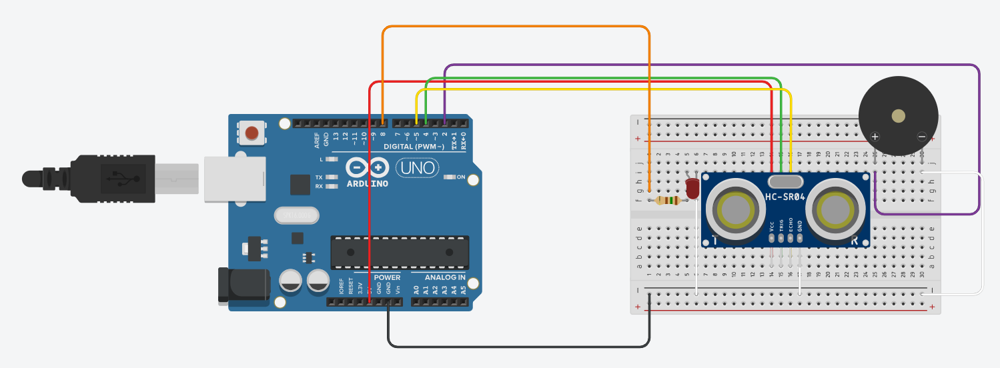
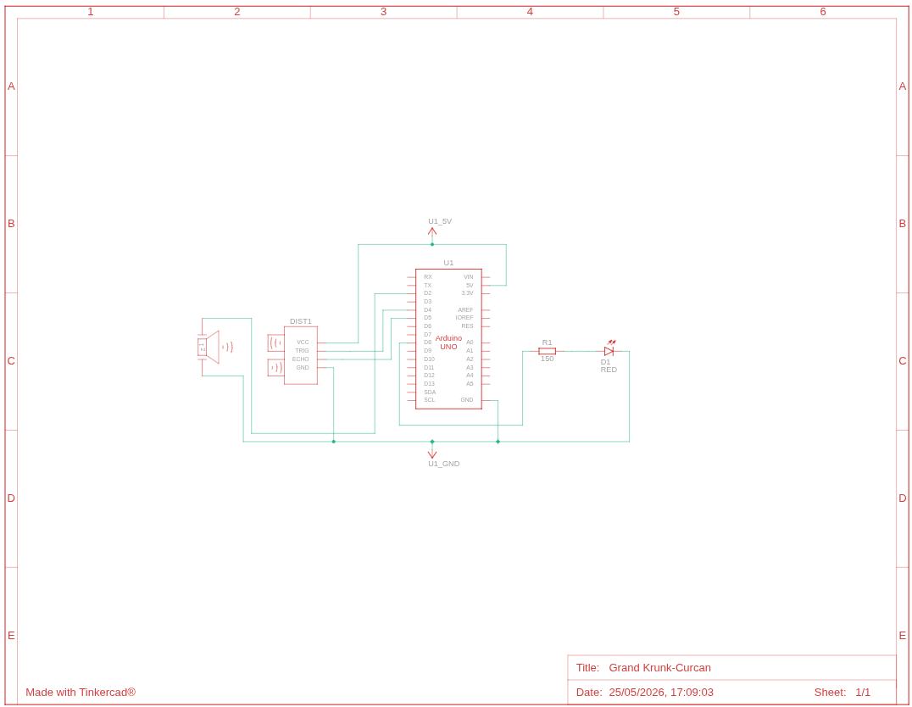

# 🔊 Alarme por Proximidade com Arduino

Projeto desenvolvido para a disciplina de **Sistemas Embarcados** — Prof. Carlos Alberto

---

## 📋 Descrição

Sistema de alarme por proximidade utilizando **Arduino Uno**, sensor ultrassônico **HC-SR04**, LED e buzzer. Quando um objeto é detectado na faixa de **50 a 60 cm**, o LED acende e o buzzer emite um bipe único de alerta. O alarme não se repete enquanto o objeto permanecer na zona — apenas ao sair e retornar.

---

## 🛠️ Componentes Utilizados

| Componente         | Quantidade |
|--------------------|------------|
| Arduino Uno        | 1          |
| Sensor HC-SR04     | 1          |
| LED vermelho       | 1          |
| Resistor 150Ω      | 1          |
| Buzzer             | 1          |
| Protoboard         | 1          |
| Jumpers            | Vários     |

---

## 🔌 Pinagem

| Pino Arduino | Componente       |
|--------------|------------------|
| D2           | Buzzer           |
| D4           | TRIG (HC-SR04)   |
| D5           | ECHO (HC-SR04)   |
| D8           | LED              |
| 5V           | VCC (HC-SR04)    |
| GND          | GND (geral)      |

---

## ⚙️ Como Funciona

1. O sensor HC-SR04 emite pulsos ultrassônicos a cada 100 ms.
2. O tempo de retorno do eco é convertido em distância (cm) pela fórmula:

```
distancia = (duracao / 2) / 29.1
```

3. Se a distância medida estiver entre **50 e 60 cm**:
   - O **LED acende**.
   - O **buzzer apita uma vez** (400 Hz por 2000 ms).
   - A flag `jaApitou` impede repetições enquanto o objeto permanecer na zona.
4. Ao sair da zona, o LED apaga, o buzzer para e o sistema é **resetado** para nova detecção.

---

## 💻 Código

```cpp
int trig = 4;
int echo = 5;
int led = 8;
int buzzer = 2;

bool jaApitou = false;

void setup(){
  Serial.begin(9600);
  pinMode(trig, OUTPUT);
  pinMode(echo, INPUT);
  pinMode(led, OUTPUT);
  pinMode(buzzer, OUTPUT);
}

void loop(){
  digitalWrite(trig, LOW);
  delayMicroseconds(2);
  digitalWrite(trig, HIGH);
  delayMicroseconds(10);
  digitalWrite(trig, LOW);

  int duracao = pulseIn(echo, HIGH);
  int distancia = (duracao / 2) / 29.1;

  Serial.print("Distancia: ");
  Serial.print(distancia);
  Serial.println(" cm");

  if (distancia >= 50 && distancia <= 60){
    digitalWrite(led, HIGH);
    if (jaApitou == false) {
      tone(buzzer, 400, 2000);
      jaApitou = true;
    }
  } else {
    digitalWrite(led, LOW);
    noTone(buzzer);
    jaApitou = false;
  }

  delay(100);
}
```

---

## 🗺️ Circuito

### Diagrama de montagem (Tinkercad)



### Esquema elétrico



---

## 📊 Lógica de Estados

```
Objeto fora da zona (< 50 cm ou > 60 cm)
        │
        ▼
  LED apagado | Buzzer silencioso | jaApitou = false
        │
        ▼  (objeto entra na zona: 50–60 cm)
  LED aceso | Buzzer apita UMA VEZ | jaApitou = true
        │
        ▼  (objeto permanece na zona)
  LED aceso | Buzzer silencioso | jaApitou = true (sem repetir)
        │
        ▼  (objeto sai da zona)
  LED apagado | jaApitou = false → pronto para nova detecção
```

---

## 🚀 Como Usar

1. Monte o circuito conforme o diagrama acima.
2. Abra o arquivo `BuzzerProximo.ino` na **Arduino IDE**.
3. Selecione a placa **Arduino Uno** e a porta COM correta.
4. Faça o upload do código.
5. Abra o **Monitor Serial** (9600 baud) para acompanhar as leituras de distância em tempo real.
6. Aproxime um objeto até a faixa de 50–60 cm e observe o LED e o buzzer.

---

## 📁 Estrutura do Repositório

```
📦 projeto-alarme-proximidade
 ┣ 📄 BuzzerProximo.ino       # Código-fonte Arduino
 ┣ 🖼️ code.png                # Captura do código
 ┣ 🖼️ FotosThinker.png        # Montagem no Tinkercad
 ┣ 🖼️ CircuitoEletrico.png    # Esquema elétrico
 ┗ 📄 README.md               # Este arquivo
```

---

## 👨‍💻 Autores

Desenvolvido como atividade prática da disciplina de **Sistemas Embarcados**.  
**Professor:** Carlos  Alberto

*Feito por Guilherme Izidio*

---


